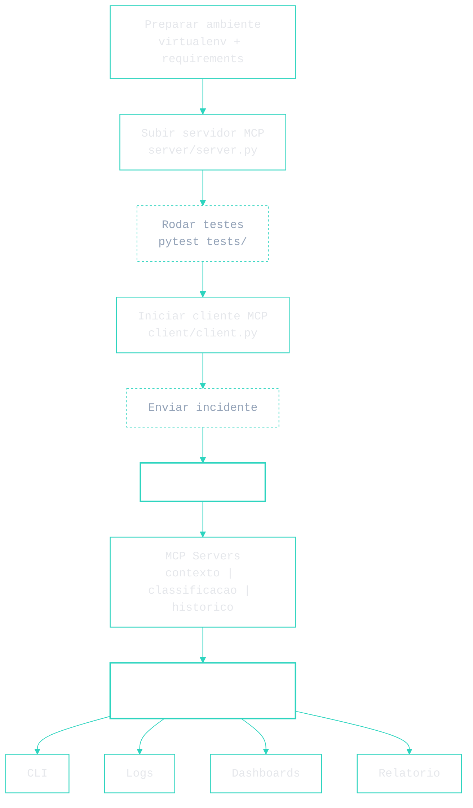

\[[🇧🇷 Português](README.pt_BR.md)\] \[**[🇬🇧 English](README.md)**\]


<br><br>


#  <p align="center"> 🕸️ [Distributed Systems]() / [Project](): [MCP Smart Incident Analyzer]()
### <p align="center"> Distributed Communication for AI with MCP (Model Context Protocol


<br><br>
<!-- ========= END REPO TITLE ========= -->


<!-- ========= START MAIN BADGE ========= -->
<p align="center" style="margin: 0;">
  <a href="https://stalwart-rolypoly-b74468.netlify.app/" target="_blank" rel="noopener noreferrer">
    
  </a>
</p>

<!-- ========= START SECONDARY BADGES ========= -->
<p align="center" style="margin: 0;">
  <a href="https://docs.google.com/presentation/d/1sgzuw0826E6xGrU9MUKSbU-BiJSKd8LN/edit?slide=id.p1#slide=id.p1" target="_blank" rel="noopener noreferrer">
    
  </a><a href="https://github.com/Mindful-AI-Assistants/3-distributed-system-mcp-smart-incident-analyzer/blob/cbd8f804a231a902a3590199e30d6a90153bf4d8/DATA_ANALYSING_REPORT/%F0%9F%87%A7%F0%9F%87%B7Portugues/Data%20Analysing%20Report%20-%20MCP%20Incidents.pdf" target="_blank" rel="noopener noreferrer">
    
  </a>
</p>

<!-- ========= END BADGES ========= -->


<br><br><br><br>
<!-- ========= END BADGE ========= -->

<!-- ======================================= Start nstitucional INFO ===========================================  -->

<!-- ========= START SPONSORT BADGE ========= -->
 <!--### <p align="center">    -->

[**Institution:**]() Pontifical Catholic University of São Paulo (PUC-SP  Humanistic AI & Data Science • 5º Semestre • 2026 <br>
[**School:**]() Faculty of Interdisciplinary Studies  <br>
[Course Repo:]() INTEGRATED PROJECT: MACHINE LEARNING - 128 Hours <br>
**Professor:**  [⭐️ Carlos Eduardo Paes]()  <br>
[**Authors**:**  [Fabiana ⚡️ Campanari](https://linktr.ee/fabianacampanari) e [Perdro Vyctor Almeida]()  <br>


<br><br>

<!-- ========= END Institucional INFO ========= -->


<br><br>


<!-- ========= START SPONSORT BADGE ========= -->
 <!--### <p align="center">    -->

#### <p align="center"> [](https://github.com/sponsors/Mindful-AI-Assistants)


<br><br>
<!-- ========= END SPONSORTBADGE ========= -->


<!-- =========  START DEMO VIDEO ========= -->
https://github.com/user-attachments/assets/b6c59c99-00a4-4545-b0ed-c8b262cd4709

###### 🎶 Habanera -- Remix
###### **Source:** Aria from the opera *Carmen*
###### **Significance:** Among the most iconic and enduring pieces in operatic history

> 🎶 *“L’amour est un oiseau rebelle que nul ne peut apprivoiser.”*

#

<p align="right">
<sub><em>curated edit · Fab⚡️</em></sub>
</p>


<br><br>
<!-- =========  END PUC DENO VIDEO ========= -->


<!-- ========= START Institucional INFO ========= -->


<!-- ======================================= Start DEFAULT HEADER ===========================================  -->

<!-- ========= START Confidentiality statement ========= -->

> [!NOTE]
> 
> ⚠️ Heads Up
>
> * Projects may be made [publicly available]() whenever possible  
> * Focus on **hands-on experience** with real datasets  
> * Activities follow [**PUC-SP academic and ethical guidelines**]()  
> * Restricted content remains **confidential**  
> <br>


<br><br>

X

<br><br>
<!-- ========= End Confidentiality statement ========= -->


<!-- ========= START Repo TIP ========= -->
> [!TIP]
> ### 🚀 AI Resources
>
> High-signal links for learning, building, and understanding modern AI systems.
>
> **📘 Core Reading**
> - [*Inteligência Artificia A Modern Approachl (Peter Norvig, Stuart Russell*](https://github.com/Mindful-AI-Assistants/3-distributed-system-mcp-smart-incident-analyzer/blob/90f1da40fa7a5a4887c49b9471f15744c7d132a4/Intelige%CC%82ncia%20Artificia%20A%20Modern%20Approachl%20(Peter%20Norvig%2C%20Stuart%20Russell)%20.pdf)
>
> 
> <br>
> _Signal > noise._
> <br>
><br>
>

<br><br><br><br>
<!-- ========= END Repo TIP ========= 

-------------🎥🎥🎥🎥🎥🎥🎥🎥

<!-- ========= START DEMO Video  ========= -->


<!-- <br><br><br><br> ========= -->
<!-- ========= END Video building-llms-yann-dubois-stanford-cs229-2024 ========= -->


## [Visão geral]()

O **MCP Smart Incident Analyzer** é um projeto de arquitetura distribuída voltado à análise inteligente de incidentes relacionados a sistemas de **IA (Inteligência Artificial)**. O núcleo da proposta é o uso de **MCP (Model Context Protocol)** como base para comunicação estruturada entre componentes, agentes e serviços especializados.

Na prática, o sistema foi concebido para receber eventos, ocorrências, falhas, desvios ou comportamentos inesperados em ambientes baseados em IA, organizar esse material como contexto analítico e encaminhá-lo para módulos especializados de interpretação. O objetivo é transformar incidentes complexos em casos rastreáveis, explicáveis, documentáveis e auditáveis.


<br><br>

## Índice

- [1. Contexto do problema](#1-contexto-do-problema)
- [2. Objetivo do projeto](#2-objetivo-do-projeto)
- [3. Proposta da solução](#3-proposta-da-solução)
- [4. Por que usar MCP](#4-por-que-usar-mcp)
- [5. Conceitos e siglas fundamentais](#5-conceitos-e-siglas-fundamentais)
- [6. Arquitetura da solução](#6-arquitetura-da-solução)
- [7. Arquitetura lógica e arquitetura física](#7-arquitetura-lógica-e-arquitetura-física)
- [8. Componentes principais](#8-componentes-principais)
- [9. Fluxo operacional do sistema](#9-fluxo-operacional-do-sistema)
- [10. Estrutura do projeto](#10-estrutura-do-projeto)
- [11. Tecnologias utilizadas](#11-tecnologias-utilizadas)
- [12. Como o sistema funciona na prática](#12-como-o-sistema-funciona-na-prática)
- [13. Como executar o projeto](#13-como-executar-o-projeto)
- [14. Exemplo de uso](#14-exemplo-de-uso)
- [15. Casos de uso](#15-casos-de-uso)
- [16. Diferenciais técnicos](#16-diferenciais-técnicos)
- [17. Benefícios acadêmicos e práticos](#17-benefícios-acadêmicos-e-práticos)
- [18. Limitações atuais](#18-limitações-atuais)
- [19. Evoluções futuras](#19-evoluções-futuras)
- [20. Organização para relatório e apresentação](#20-organização-para-relatório-e-apresentação)
- [21. Preview esperado da interface](#21-preview-esperado-da-interface)
- [22. Licença](#22-licença)
- [23. Conclusão](#23-conclusão)

<br><br>


<!--

### 11.3 Etapa 2 – Subir o servidor MCP

O servidor MCP é responsável por expor os métodos que serão consumidos pelo cliente para realizar a análise distribuída de incidentes.

```bash
# Dentro da raiz do projeto
python server/server.py
```

Verifique no terminal se o servidor iniciou corretamente (porta e logs básicos de inicialização).

### 11.4 Etapa 3 – Rodar testes de conectividade

Antes de usar o sistema, recomenda-se rodar os testes automatizados para validar a comunicação básica entre client e server.

```bash
pytest tests/
```

Se os testes falharem, corrija a configuração ou o código antes de avançar.

### 11.5 Etapa 4 – Interagir com o cliente MCP

O cliente MCP é o entrypoint interativo para enviar incidentes e acionar o fluxo distribuído.

Em um novo terminal (mantendo o servidor rodando):

```bash
cd mcp-smart-incident-analyzer
source .venv/bin/activate  # se necessário
python client/client.py
```

A partir do menu/CLI, você poderá:

- enviar um incidente de exemplo;
- listar capacidades do servidor;
- inspecionar respostas e metadados retornados pelo protocolo MCP.

### 11.6 Etapa 5 – Fluxo distribuído de análise de incidentes

Quando um incidente é enviado pelo cliente MCP, o pipeline lógico segue esta sequência:

1. **Entrada**: o usuário descreve o incidente (texto, metadados, parâmetros).
2. **Orquestração**: o orquestrador estrutura o caso em um contexto padronizado.
3. **Distribuição via MCP**:
   - servidor de contexto: enriquece a descrição;
   - servidor de classificação: avalia severidade/tipo;
   - servidor de histórico: busca incidentes semelhantes.
4. **Consolidação**: a camada analítica combina as respostas.
5. **Saída**: o resultado final é apresentado de forma explicável (resumo, classificação, histórico correlato).

### 11.7 Etapa 6 – Interpretação da saída

Após o processamento, o usuário pode:

- analisar a classificação do incidente;
- entender por que aquela classificação foi atribuída (contexto + explicações);
- observar histórico de casos relacionados;
- reutilizar a saída em dashboards, relatórios ou apresentações.

### 11.8 Etapa 7 – Pipeline de documentação e apresentação

O próprio README-mestre funciona como base para:

- **relatório acadêmico** (seções podem ser copiadas/refinadas);
- **apresentação em slides HTML** (cada seção vira 1 ou mais slides);
- **documentação técnica no GitHub** (ponto único de verdade).

---

### 11.9  -->

## [MCP INCIDENT PIPELINE · ARCHITECTURE OVERVIE]()

<br>



<br><br>


<br><br>
<br><br>
<br><br>
<br><br>
<br><br>
<br><br>
<br><br>
<br><br>
<br><br>


<!-- ======================================= Start DEFAULT Footer ===========================================  -->

<br><br>


## 💌 [Let the data flow... Ping Me !](mailto:fabicampanari@proton.me)

<br>


#### <p align="center">  🛸๋ My Contacts [Hub](https://linktr.ee/fabianacampanari)


<br>

### <p align="center"> 


<br><br>

<p align="center">  ────────────── ⊹🔭๋ ──────────────

<!--
<p align="center">  ────────────── 🛸๋*ੈ✩* 🔭*ੈ₊ ──────────────
-->

<br>

<p align="center"> ➣➢➤ <a href="#top">Back to Top </a>
  

  
#
 
##### <p align="center">Copyright 2026 Mindful-AI-Assistants. Code released under the  [MIT license.](https://github.com/Mindful-AI-Assistants/CDIA-Entrepreneurship-Soft-Skills-PUC-SP/blob/21961c2693169d461c6e05900e3d25e28a292297/LICENSE)


<!-- ======================================= End  DEFAULT Footer ===========================================  -->


